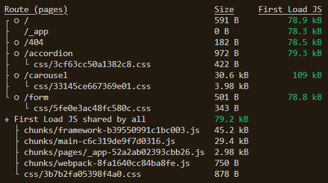

# Part.12 개발생산성 및 성능 개선을 위한 퍼포먼스 최적화

## 목적

퍼포먼스 최적화가 되지 않은 프로젝트를 최적화 하여 빌드 결과물을 줄이는 것

## 요구사항

import와 dependencies를 올바르게 수정함으로써 빌드 결과물을 최적화 하는것이 목적입니다.

이로 인한 빌드 결과물은 다음과 같아야 합니다.

## 구성 안내

몇가지 불필요한 dependencies 를 추가하였습니다.

- react-icons (한개의 아이콘만 필요한 상황, svg 사용이 더 좋을 수도 있는 상황)
- react-accessible-accordion (커스터마이징된 아코디언을 구성하는것이 쉽고 사이즈가 더 작을것입니다)
- react-hook-form (간단한 폼을 위해서는 이 패키지는 지나치게 무겁습니다).

현재의 빌드 결과물은 다음과 같습니다.

`Form` 과 `Accordion` 페이지는 _844b_ 에서 _8.416kb_ 로,  _1.37kb_ 에서 _4.62kb_ 로 증가했습니다.
