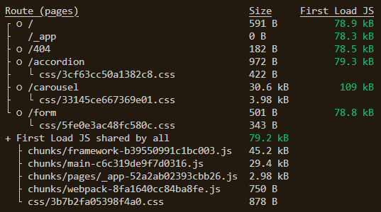
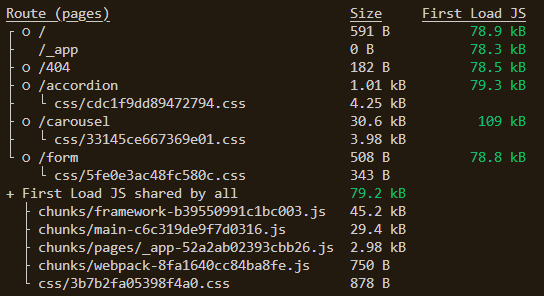

# Part.12 개발생산성 및 성능 개선을 위한 퍼포먼스 최적화

## 목적

퍼포먼스 최적화가 되지 않은 프로젝트를 최적화 하여 빌드 결과물을 줄이는 것

## 요구사항

import와 dependencies를 올바르게 수정함으로써 빌드 결과물을 최적화 하는것이 목적입니다.

이로 인한 빌드 결과물은 다음과 같아야 합니다.

## 구성 안내

사용하지 않는 css를 페이지에 추가하였습니다.

몇개의 사용하지 않는 CSS 파일들을 `Accordion` 페이지에 넣었습니다.
accordion 페이지 size는 _1.37kb_ 에서 _5.26kb_ 로 늘었습니다.

